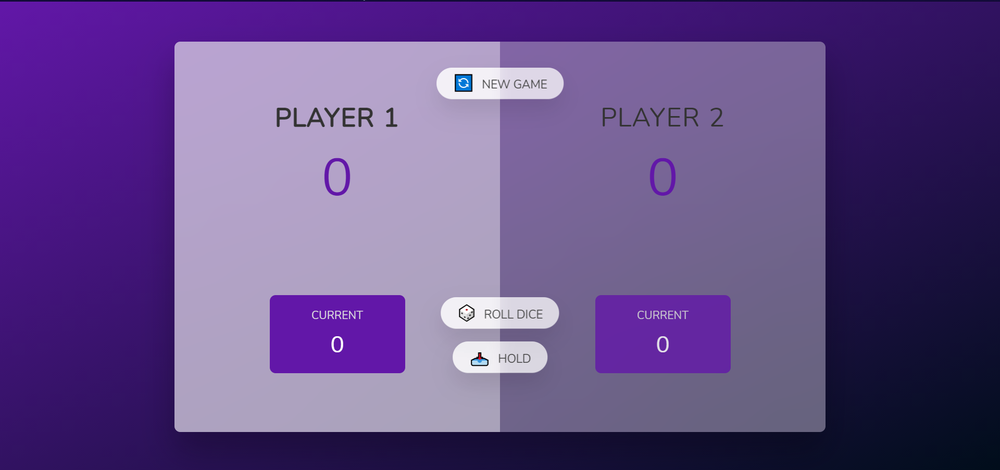

# Dice-roll-JS

This is a 100 points scoring 2 player game built using HTML, CSS and Javascript. The rule is, once you roll a 1 your turn is out and the points scored in that turn won't be consider unless its held.

Image

Link
[Play game](https://dicerollingjs.netlify.app/)
